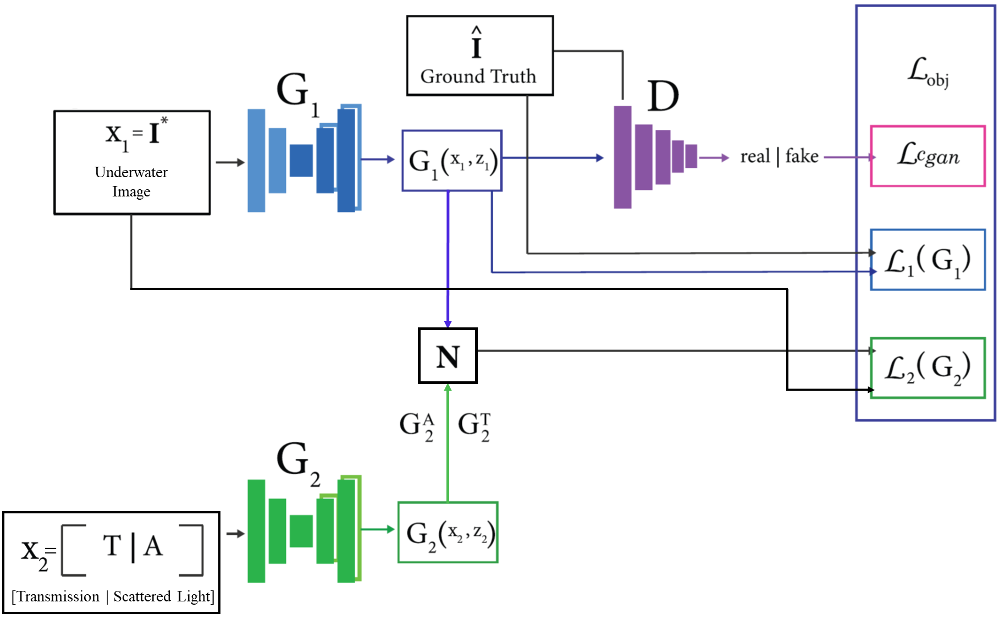

## DGD-cGAN: A Dual Generator for Image Dewatering and Restoration

This repository contains Pytorch implementation of the paper **"DGD-cGAN: A Dual Generator for Image Dewatering and Restoration"**.
<ul>
  <li> Paper: </li>
  <li> Preprint:</li>
  <li> Dataset used: http://amandaduarte.com.br/turbid/ </li>
      </ul>
      
We provide the TURBID images split into four equal sizes. The train data is available for download <a href="https://drive.google.com/file/d/13yxI85JUdsbplM7-Hh8sywIXoom-6hZu/view?usp=sharing" target="_blank"> Ground Truth </a> and <a href="https://drive.google.com/file/d/1XZesr1UCuxnp0gQ3k5tESQd7tkHvCm6t/view?usp=sharing" target="_blank"> Underwater </a> images. Test data is available inside the data folder: [Ground Truth](data/Test_groundtruth.zip) and [Underwater](data/Test_underwater.zip).

DGD-cGAN architecture

   
